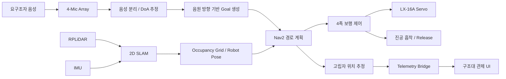
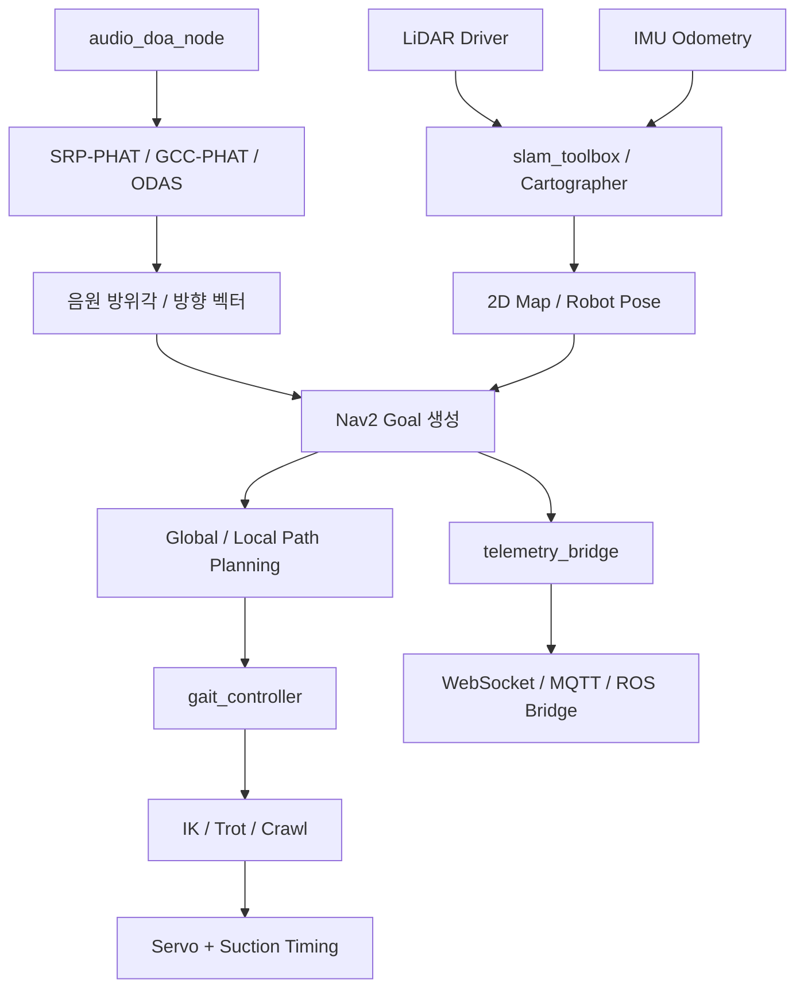

[Uploading README.md…]()
# 도마뱀 생체모방 기반 고난도 재난 접근 로봇

> **2026년 한이음 드림업 창의도전형 프로젝트**  
> 사람이 먼저 진입하기 위험한 재난 현장에 로봇을 선투입하여, **음향으로 고립자를 탐색하고 흡착식 4족 보행으로 접근한 뒤 위치 정보를 구조대에 전달하는 무인 정찰 로봇**입니다.

---

## 💡 1. 프로젝트 개요

### 1-1. 프로젝트 소개

- **프로젝트 명** : 도마뱀 생체모방 기반 고난도 재난 접근 로봇
- **프로젝트 정의** : 재난 환경에서 음성 분리·인식 및 흡착식 4족 보행 메커니즘을 활용해 수색 사각지대의 고립자를 탐색하고, 정밀 위치 데이터를 구조대에 실시간 전달하는 무인 정찰 로봇
- **핵심 목표** : 직접 구조보다 **고립자의 위치 특정**에 집중하여 구조대의 수색 시간을 줄이고 골든타임 확보에 기여

본 프로젝트는 구조대원이 즉시 진입하기 어려운 붕괴·화재 현장에서 먼저 투입되어 주변을 탐색합니다.  
LiDAR로 주변 환경을 인식하고, 4채널 마이크로 사람의 음성을 탐지하여 음원 방향을 추정합니다. 이후 추정된 음원 위치를 목표점으로 변환하여 로봇이 접근하고, 최종 위치 좌표를 구조대에 전달하는 것을 목표로 합니다.

### 1-2. 개발 배경 및 필요성

재난 현장에서는 붕괴 잔해, 유독가스, 2차 붕괴 위험 등으로 인해 구조대원의 직접 진입이 지연될 수 있습니다. 또한 넓은 수색 범위에 비해 구조 인력이 제한되어 고립자의 초기 위치를 특정하는 데 시간이 소요되고, 이로 인해 구조 골든타임을 놓칠 가능성이 있습니다.

따라서 본 프로젝트는 구조대 투입 이전에 위험 구역으로 선제 진입해 수색 사각지대를 줄이고, 고립자의 위치를 먼저 특정하여 구조 작전의 효율성과 안전성을 높이는 것을 목표로 합니다.

### 1-3. 프로젝트 특장점

- **탐색 기능에 집중한 소형·경량 구조**  
  직접 인양·파쇄 기능을 배제하고 고립자 탐색과 위치 데이터 전달에 기능을 집중하여 협소 공간 침투성을 높였습니다.

- **음향 기반 고립자 탐색**  
  연기, 먼지, 암흑 등으로 카메라 기반 인식이 어려운 환경에서도 사람의 호출음과 비명을 탐지하고 음원 방향을 추정합니다.

- **4족 보행 + 음압 흡착**  
  휠이나 무한궤도가 이동하기 어려운 비정형 잔해를 4족 보행으로 통과하고, 경사면·벽면에서는 진공 흡착 기능을 활용하도록 설계했습니다.

- **Acoustic-driven Navigation**  
  추정된 음원 방향을 자율주행 지도상의 목표점으로 변환하여, 음향 탐지 결과가 실제 이동 경로 생성으로 이어지는 폐루프 구조를 지향합니다.

- **저비용·다수 투입 가능성**  
  고가의 3D LiDAR나 대형 매니퓰레이터 대신 2D LiDAR, 마이크 어레이, 스마트 서보 중심으로 구성하여 향후 다수 기체 동시 투입에 유리하도록 설계했습니다.

### 1-4. 주요 기능

- **주변 환경 인식** : RPLiDAR와 ROS2를 이용해 주변 장애물을 인식하고 RViz로 시각화
- **장애물 경고 및 회피 경로 생성** : 전방 거리 임계값을 기반으로 위험 상태를 판단하고 SLAM/Nav2 기반 우회 경로 생성
- **음성 분리·인식** : 재난 현장의 잡음 속에서 사람의 음성을 분리하여 인식
- **음원 방향 추정** : 4채널 마이크의 입력 시간차를 이용해 음원의 방향을 벡터 형태로 산출
- **4족 보행** : 각 다리의 2축 관절을 이용해 파손된 바닥과 비정형 지형에서 이동
- **음압 흡착** : 진공 펌프, 솔레노이드 밸브, 흡착 패드를 이용해 경사면·벽면에 기체를 고정
- **자율주행** : LiDAR + IMU 기반 2D SLAM과 Nav2를 활용하여 음원 방향으로 접근
- **위치 데이터 전송** : 고립자의 최종 추정 위치를 구조대 UI로 전달

### 1-5. 기대 효과 및 활용 분야

**기대 효과**
- 구조대 진입 전 고립자 위치를 선제적으로 파악하여 초기 수색 시간 단축
- 위험 구역에 로봇을 먼저 투입해 구조대원의 2차 사고 위험 감소
- 저비용 하드웨어 구조를 기반으로 향후 여러 대의 로봇을 동시에 투입하는 군집 정찰 가능

**활용 분야**
- 지진·건축물 붕괴·화재 현장의 인명 수색 및 관제 지원
- 원자력 발전소 및 화학 플랜트의 고위험 구역 점검
- 대형 선박의 밀폐·협소 공간 정찰
- 사람이 접근하기 어려운 비정형 위험 구역의 무인 감시·정찰

### 1-6. 기술 스택

| 구분 | 기술 / 장비 |
|---|---|
| OS | Ubuntu 22.04 LTS |
| IDE | Visual Studio Code (Remote SSH / ROS Extension) |
| Middleware | ROS 2 Humble Hawksbill |
| Visualization | RViz2, Foxglove Studio |
| Language | Python 3.10, C++ |
| Robotics | ROS2, Nav2, SLAM, Occupancy Grid Mapping |
| Acoustic | SRP-PHAT, GCC-PHAT, TDoA, ODAS |
| Mapping / Planning | Cartographer / slam_toolbox, A*, DWA |
| SBC | NVIDIA Jetson Orin Nano 계열 Developer Kit |
| LiDAR | RPLiDAR A1M8-R6 |
| Microphone | ReSpeaker 4-Mic Array / XMOS XVF3800 |
| Actuator | LX-16A 스마트 직렬 버스 서보 |
| Suction | 전기 다이어프램 진공 펌프, 솔레노이드 밸브, 흡착 패드 |
| Modeling | SolidWorks |
| Collaboration | Notion, Google Spreadsheet |

---

## 💡 2. 팀원 소개


| 구분 | 이름 | 역할 | 담당 업무 | 사진 |
|---|---|---|---|---|
| 팀원 1 | `안지언` | 코딩, 개발 총괄
| 팀원 2 | `이승정` | 소프트웨어 개발 
| 팀원 3 | `강예림` | 몸체 설계및 인쇄 
| 멘토 | `서성민` | 전산회로 설계 담당 

---

## 💡 3. 시스템 구성도

### 3-1. 서비스 구성도



### 3-2. S/W 구성도



### 3-3. H/W 구성도

| 구분 | 구성 요소 | 역할 |
|---|---|---|
| 센서 입력부 | RPLiDAR A1, ReSpeaker 4-Mic Array, IMU, 압력/접지 센서 | 환경·음향·자세·흡착 상태 측정 |
| 연산부 | NVIDIA Jetson Orin Nano | ROS2, 음향 처리, SLAM, 자율주행 연산 |
| 구동부 | LX-16A 서보 모터 | 4족 보행 관절 구동 |
| 흡착부 | 진공 다이어프램 펌프, 솔레노이드 밸브, 흡착 패드 | 벽면·경사면 고정 및 해제 |
| 전원부 | Li-Po 배터리, 스텝다운 벅 컨버터 | 연산부·센서·구동부 전원 공급 |

### 3-4. 동작 흐름

1. LiDAR와 IMU로 주변 환경을 인식하고 2D 지도를 생성합니다.
2. 4채널 마이크로 재난 현장의 소리를 수집합니다.
3. 잡음 속 사람의 음성을 분리하고 마이크 입력 시간차를 이용해 음원 방향을 추정합니다.
4. 추정된 방향을 지도상의 목표점으로 변환합니다.
5. Nav2가 장애물을 고려한 접근 경로를 생성합니다.
6. 4족 보행 및 음압 흡착 기능으로 목표 지점에 접근합니다.
7. 최종 고립자 위치를 구조대 관제 화면에 전달합니다.

### 3-5. 주요 구현 화면 및 H/W

#### LiDAR 장애물 인식

| Safe 상태 | Danger 상태 |
|---|---|
|  |  |

- **Safe** : 정면 측정 거리가 임계값보다 충분히 큰 상태
- **Danger** : 정면 측정 거리가 임계값 이하로 감소하여 근접 장애물이 있다고 판단한 상태

#### 4족 보행용 LX-16A 서보

<p align="center">
  
</p>

#### 음압 흡착용 진공 펌프

<p align="center">
  
</p>

---

## 💡 4. 작품 소개영상

> **현재 개발보고서에는 작품 소개영상의 YouTube URL이 포함되어 있지 않습니다.**  
> 영상 업로드 후 아래 형식으로 썸네일과 링크를 연결하면 됩니다.

```md
[](https://youtu.be/VIDEO_ID)
```

`VIDEO_ID`를 실제 YouTube 영상 ID로 변경해 주세요.

---

## 💡 5. 핵심 소스코드

### 5-1. 음성 분리·인식 및 음원 방향 추정

**소스코드 설명**  
4채널 마이크 입력을 이용해 재난 현장의 잡음 속에서 사람의 음성을 인식하고, 각 마이크에 소리가 도달하는 시간차를 바탕으로 음원 방향을 추정하는 기능입니다. 개발보고서에서는 Python 기반 오디오 처리와 음원 방향 벡터 산출 기능을 구현한 것으로 정리되어 있습니다.

| 핵심 코드 화면 | 실행 결과 |
|---|---|
|  |  |

주요 처리 흐름:

```text
4-Mic Audio Input
        ↓
Noise / Voice Processing
        ↓
TDoA / Phase Difference
        ↓
DoA Vector Estimation
        ↓
Target Direction
```

### 5-2. LiDAR 기반 전방 장애물 인식

**소스코드 설명**  
RPLiDAR의 거리 데이터를 ROS2 노드에서 받아 로봇 정면의 측정값을 확인하고, 사전에 설정한 거리 임계값 이하의 장애물이 감지되면 위험 상태를 판단하여 RViz Marker로 표시하는 기능입니다.

```text
LaserScan 수신
      ↓
정면 구간 거리 추출
      ↓
임계값과 비교
   ↙        ↘
 Safe      Danger
            ↓
      RViz Marker 표시
```

### 5-3. SLAM 및 자율주행

**소스코드 설명**  
LiDAR와 IMU 정보를 바탕으로 2D Occupancy Grid Map을 생성하고 로봇 위치를 추정합니다. 음원 방향으로부터 생성된 목표점을 Nav2에 전달하고, A* / DWA 기반 경로 계획을 통해 장애물을 회피하며 접근하도록 구성합니다.

```text
LiDAR + IMU
     ↓
2D SLAM
     ↓
Robot Pose + Map
     ↓
Acoustic Goal
     ↓
Nav2 Path Planning
     ↓
4족 보행 제어
```

### 5-4. 4족 보행 및 흡착 제어

**소스코드 설명**  
`gait_controller`에서 역운동학(IK)을 바탕으로 다리 관절의 목표 궤적을 생성하고, 보행 시 발의 접지·이탈 시점에 맞춰 진공 흡착 및 해제 타이밍을 동기화하는 구조를 사용합니다.

> 실제 GitHub 저장소의 파일명, 함수명, launch 명령은 개발보고서에 기재되어 있지 않으므로 임의로 작성하지 않았습니다.  
> 최종 제출 시 실제 저장소의 핵심 `.py` / `.cpp` 파일명과 함께 코드 블록을 추가하면 가장 좋습니다.

---

## 개발 진행 현황

> 아래 진척도는 개발보고서 작성 시점 기준입니다.

| 구분 | 기능 | 진척도 | 비고 |
|---|---|---:|---|
| S/W | 전방 장애물 인식 | 100% | LiDAR + ROS2 기반 |
| S/W | 음성 분리 인식 | 100% | 음성 인식 및 음원 방향 추정 |
| H/W | 4족 보행 | 40% | 기구부·보행 제어 개발 진행 |
| H/W | 음압 흡착 | 5% | 개발 진행 중 |

---

## 문제 해결 경험

### H/W 제작 지연 대응

4족 보행 프레임의 3D 프린팅과 흡착 기구부 조립 공차 수정으로 실제 기구 제작 일정이 지연되었습니다. 이를 해결하기 위해 폼보드·종이·박스 등으로 실제 스케일과 유사한 간이 목업을 먼저 제작하여 센서 배치, 배선 경로, 무게중심, 간섭 요소를 점검하고 S/W 개발을 병행했습니다.

### 2D LiDAR의 3D 매핑 한계 대응

RPLiDAR A1의 단일 평면 측정 한계를 고려하여 완전한 3D 지도보다 구조대가 즉시 활용할 수 있는 **고립자의 평면상 위치(X, Y)**에 집중했습니다. 이에 2D Occupancy Grid Map을 기반으로 음원 위치를 지도 위에 표시하고, IMU 정보를 이용해 기체 기울기에 따른 오차를 보정하는 방향으로 시스템을 최적화했습니다.

---

## 한 줄 소개

> **사람이 먼저 들어가기 위험한 재난 현장에 로봇을 선투입해, 소리로 고립자를 찾고 흡착식 4족 보행으로 접근하여 구조대에 정확한 위치를 전달한다.**
